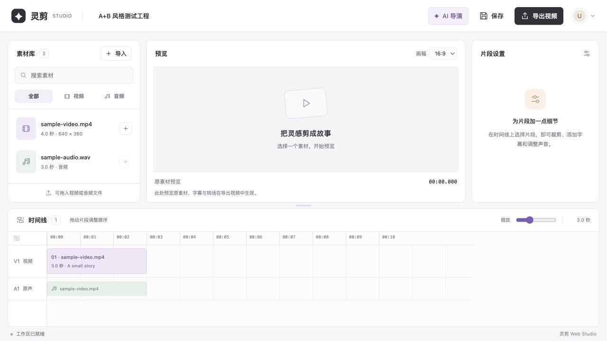

# 灵剪 LingJian AI Video Editor

**Version:** 4.13.0 · **Platform:** any OS with Python 3.11+ and FFmpeg (browser-based editor) · **Source runtime:** Python 3.11+

LingJian is a browser-based nonlinear video editor with auditable AI-assisted editing. The web editor is the only supported product surface. The earlier PySide6 desktop application remains in the repository for reference but is no longer maintained (see [Desktop application (legacy)](#desktop-application-legacy)).

## Quick start

```sh
python -m pip install -r requirements-web.txt
python web_app.py
```

Open `http://127.0.0.1:5000`. Set `PORT` to use another port; macOS reserves 5000 for AirPlay Receiver, so `PORT=5002 python web_app.py` is a common choice there. On the first launch the login page asks you to create the initial administrator account. There is no default username or password.

FFmpeg lookup order: `LINGJIAN_FFMPEG`, `ffmpeg.exe` beside `web_app.py` (Windows only), `ffmpeg` on `PATH`, then the `imageio-ffmpeg` package that `requirements-web.txt` installs. `GET /api/health` reports which executable is in use and whether export is ready.

Uploaded media, the working project, the media catalog, exports, and the account database are kept under `web_workspace/` (override with `LINGJIAN_WEB_WORKSPACE`). The server binds to localhost by default.

## Public deployment

The repository includes a production Docker image and Render Blueprints for a temporary free demo (`render.yaml`, data is lost on restart) or a persistent team workspace (`deploy/render-persistent.yaml`, paid compute and disk). See the [deployment guide](docs/deployment.md) for HTTPS hosting, first-admin setup, team accounts, and GPT API configuration. No live site is created just by adding these files.

[Deploy the free demo to Render](https://render.com/deploy?repo=https://github.com/DuGrace123/hackthon0919)

This version uses one shared project for all signed-in teammates. Production uses one Gunicorn worker, protects initial administrator creation with a setup key, limits concurrent exports, and stores uploads/accounts/projects on the configured volume. The CI check builds the Linux image and verifies a real captioned MP4 export and persistence across a server restart.

## What you can do

| Area | Capabilities |
| --- | --- |
| Media pool | Upload video and audio through the browser. The server probes every file with FFmpeg; originals stay in the media library when timeline clips are removed. |
| Timeline editing | Light three-column layout with the media pool on the left, the program monitor in the center, the clip inspector on the right, and video/audio tracks across the bottom. Trim points, captions, transitions, source-audio volume, drag-to-reorder, timeline zoom, and a resizable timeline. |
| AI 导演 / AI Director | Pick source clips, a target duration, and an editing brief. Local mode analyzes scenes with FFmpeg and never uploads footage; cloud mode (when configured on the server) adds content analysis and narrative planning. Preview the shot list, apply it to the timeline, undo in one click. |
| Accounts and AI service | Administrators create editors or other administrators, change roles, enable or disable access, reset passwords, and delete accounts, and connect the cloud AI service (URL, API key, models) with a connection test. Passwords are stored as one-way hashes; write requests use a session-bound CSRF token. |
| Export | Portrait, landscape, and square MP4 presets using H.264/AAC, rendered asynchronously with preflight checks and output validation. |
| Language | The **EN / 中文** control in the account menu switches the whole interface; language and layout settings are remembered in the browser. |

## Clean web workspace



The light interface combines the editing layout of [OpenCut](https://github.com/OpenCut-app/opencut-classic) with the quiet file-list styling of [Square UI Files](https://github.com/zerostaticthemes/square-ui/tree/master/templates/files): a searchable media library, central source preview, clip settings, and a bottom timeline. These are visual references; the implementation uses the existing Flask templates and vanilla JavaScript, without adding a frontend build step or copying either project's source.

Search filenames, filter by video/audio, or drop files into the media library. The **+** beside a video adds it to the timeline. Select a clip to trim it or add captions; transition and volume controls are under **转场与声音 / Transitions & audio**. Audio files can be imported and previewed, but the current web timeline only accepts video clips. The A1 row represents each video's source audio, not a separate audio-editing track. Source preview does not render captions or transitions; those are applied during MP4 export.

Use the account menu at the top right for **EN / 中文**, account management, and sign-out. Drag clips or use their earlier/later buttons to reorder them. The horizontal divider and timeline zoom control support keyboard adjustment; language and layout settings are remembered in the browser. On narrow screens the preview, library, timeline, and clip settings stack vertically. Login and account management share the same light design.

Importing a batch is all-or-nothing: validation or catalog-write failures remove that batch’s files and preserve previously imported media. An export continues if its progress dialog is closed; click Export again while it is running to reopen its progress.

## Make your first video

Open the **使用指南 / Guide** link on the login page, editor toolbar, or account-management page. The public [`/guide`](https://lingjian-demo.onrender.com/guide) page explains the four-step workflow, AI setup, shared workspace, and temporary storage, and offers a one-page PDF download without requiring a login. Guide links open a new tab to preserve the editing session. The HTML and PDF use the same content in `web/user_guide.json`; see [guide maintenance](docs/user_guide.md) when updating it.

1. **Import footage.** Click **＋ 导入 / Import** and select video or audio files. The login page and every screen switch between 中文 and English with the language control in the top-right corner.
2. **Ask the AI Director for a cut.** Click **AI 导演 / AI Director**, tick the source clips, set the target duration (5–180 seconds), describe what you want, and click **生成方案 / Generate Plan**. Local mode needs no API key.
3. **Review the report.** The panel explains the story line, the structure and ordering basis (capture time or your source order), the editing techniques used, how much of each source was used, and every shot with its role, in/out points, caption, and reason. Click a shot to preview it in the program monitor, or copy the full text report. Choose **冷开场 / Cold open** or **纯时间顺序 / Strict chronological** and a directing style before generating.
4. **Apply or discard.** **应用到时间线 / Apply to Timeline** replaces the video clips, saves the project to disk, and marks the new clips with an **AI** badge. **撤销应用 / Undo Apply** restores the previous timeline. Manual edits made after a plan was generated block applying it (HTTP 409), so a plan can never overwrite work it has not seen.
5. **Refine, save, export.** Trim, caption, and reorder clips as usual, click **保存 / Save**, then **导出视频 / Export**.

## Optional cloud analysis

Administrators connect the cloud service under **账户管理 / Accounts → AI 接口 / AI Service**: service URL (HTTPS only), API key, vision model, transcription model, and request timeout, with a **测试连接 / Test Connection** button that calls the provider's model list and sends half a second of silence through the transcription endpoint, so a chat model entered in the transcription slot is caught before saving. Settings are stored on the server in `web_workspace/ai_settings.json` (DPAPI-encrypted on Windows, owner-readable elsewhere), are never returned to browsers, and cannot be read or changed by editor accounts. Saved settings take precedence over the environment variables below, which remain available for headless deployments. Plan requests from the browser never carry keys, endpoints, or model names.

| Environment variable | Default |
| --- | --- |
| `FIGSTUDIO_AI_API_KEY` | empty; without web settings cloud mode is unavailable and local mode still works |
| `FIGSTUDIO_AI_BASE_URL` | `https://api.openai.com` (HTTPS required) |
| `FIGSTUDIO_AI_MODEL` | `gpt-5-mini` |
| `FIGSTUDIO_AI_TRANSCRIPTION_MODEL` | `gpt-4o-mini-transcribe` |

The configured service must support `/v1/responses` with image input and structured JSON output, and `/v1/audio/transcriptions`. During a cloud run the server sends contact sheets, extracted audio, the editing brief, and analysis context; the AI Director panel requires an explicit consent tick for every cloud plan. See [cloud API setup](docs/cloud_ai_setup.md).

## Backend API (optional)

`python -m backend` starts a separate FastAPI service at `http://127.0.0.1:8000/docs` that stores multiple `.ljproject` files under `workspace/` and exposes the same AI planning, apply, and undo operations for integrations. The web editor does not depend on it. Install its dependencies with `requirements-backend.txt`; see the [backend API guide](docs/backend_api.md) and the [AI workflow guide](docs/ai_workflow_integration.md).

## Desktop application (legacy)

`video_editor_app.py` is the earlier Windows desktop interface (PySide6, ONNX person segmentation, bundled `ffmpeg.exe`, optional `models/u2net_human_seg.onnx`). It is no longer the development target. Its dependencies stay in `requirements.txt` and the Windows installer is described in the [download guide](docs/download_guide.md). The web editor shares the same `.ljproject` format and editing engine, so existing projects remain readable.

## Project structure

```text
.
├── web_app.py                 # Web editor: authenticated Flask app, editing API, AI Director routes
├── web_auth.py                # SQLite account store and validation
├── web/                       # Login, account-management, and editing interfaces
├── ai_workflow.py             # Reviewable AI plans: background analysis, apply and undo transactions
├── ai_story_planner.py        # Local scene analysis, cloud requests, narrative planning, continuity
├── edit_plan.py               # Edit-plan construction, validation, and application
├── creative_treatment.py      # Whole-video caption, motion, sound, and music choices
├── editing_preferences.py     # Preferences learned from user-edited timelines
├── video_editing_engine.py    # Project data, media probing, editing, and rendering
├── builtin_music.py           # Bundled music metadata and generation
├── builtin_sound_effects.py   # Bundled sound-effect metadata and generation
├── backend/                   # Optional FastAPI service: multi-project store + AI routes
├── ai_workflow_api.py         # FastAPI router used by backend/
├── video_editor_app.py        # Legacy desktop entry point
├── multitrack_timeline.py     # Legacy desktop timeline widgets
├── person_segmentation.py     # Legacy desktop person segmentation
├── assets/                    # Fonts, generated music loops, sound effects
├── docs/                      # Setup, design, release notes, component notices
├── examples/                  # Local sample projects and renders
├── tests/                     # Portable checks, web editor tests, FFmpeg rendering tests
├── requirements-web.txt       # Web editor dependencies
├── requirements-backend.txt   # Optional backend API dependencies
└── requirements.txt           # Legacy desktop dependencies
```

Start with `web_app.py` to follow the application workflow. AI planning runs through `ai_workflow.py`, `ai_story_planner.py`, and `edit_plan.py`; `video_editing_engine.py` owns the project operations and rendering commands. Files in `examples/` are local sample artifacts and may reference source media that is not included.

## Tests

Run the portable regression suite from the project root:

```sh
python tests/run_regression_tests.py
```

It covers edit-plan validation, automatic ordering, continuity, editing preferences, long-form sequencing, capture chronology, the project store (validation, atomic saves, revisions, backups), and the AI request flow. These checks use the Python standard library and a local mock API; they do not require a browser, a cloud key, or FFmpeg. The mock API needs permission to listen on the loopback interface.

The web editor and its AI Director are covered by `tests/test_web_app.py` (login, accounts, upload, timeline editing, export, AI plan preview/apply/undo, revision conflicts, privacy). The HTTP checks in `tests/test_backend_api.py` run when `fastapi` is installed and are skipped otherwise:

```sh
python -m pytest tests/test_web_app.py tests/test_ai_workflow.py tests/test_backend_api.py
```

With FFmpeg available, run the additional rendering checks from the project root:

```sh
python -m tests.test_video_editing_engine
python -m tests.test_transitions_and_masks
```

These generate test media and render actual output files. The portable suite does not replace rendering checks or a manual browser smoke test.

## Documentation

- [Integrated AI workflow and browser contract](docs/ai_workflow_integration.md)
- [Cloud API configuration](docs/cloud_ai_setup.md)
- [Backend API and project persistence](docs/backend_api.md)
- [Release notes](docs/release_notes.md)
- [Creative-treatment design](docs/creative_treatment_design.md)
- [Download and checksum (legacy desktop installer)](docs/download_guide.md)
- [Third-party components and licenses](docs/third_party_notices.md)
